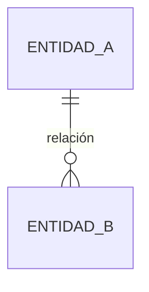

# Modelo de datos

Base de datos: SQLite · ORM: SQLAlchemy

---

## Tabla: `accounts`

| Campo | Tipo | Notas |
|-------|------|-------|
| id | INTEGER PK | autoincrement |
| code | VARCHAR UNIQUE | `caixabank` / `santander` / `revolut` |
| name | VARCHAR | Nombre para mostrar |
| balance | FLOAT | Último saldo conocido |
| last_updated | DATETIME | Fecha del último import |

---

## Tabla: `movements`

| Campo | Tipo | Notas |
|-------|------|-------|
| id | INTEGER PK | autoincrement |
| account_id | FK → accounts.id | |
| date | DATE INDEXED | Fecha operación |
| value_date | DATE | Fecha valor (puede ser null) |
| description | VARCHAR | Descripción del banco |
| concepto | VARCHAR | Etiqueta manual (columna CONCEPTO de la sheet) |
| category | VARCHAR INDEXED | Categoría mapeada (ver categories.py) |
| amount | FLOAT | Positivo = ingreso, negativo = gasto |
| balance_after | FLOAT | Saldo tras la operación |
| notes | VARCHAR | Notas manuales |
| is_manual | BOOLEAN | True = entrada manual (Revolut) |
| dedup_hash | VARCHAR UNIQUE | MD5(account\|date\|amount\|description[:80]) |
| import_batch | VARCHAR | ID del lote de importación |
| created_at | DATETIME | |

---

## Tabla: `budgets`

| Campo | Tipo | Notas |
|-------|------|-------|
| id | INTEGER PK | |
| year | INTEGER | |
| month | INTEGER | |
| category | VARCHAR | Debe existir en categories.py |
| amount | FLOAT | Presupuesto para el mes |

Constraint único: `(year, month, category)`

---

## Categorías (definidas en `app/categories.py`)

| Categoría | Color | Es ingreso |
|-----------|-------|-----------|
| Ingresos | #10b981 | Sí |
| Gastos Fijos | #f59e0b | No |
| Tenis Lucía | #8b5cf6 | No |
| Gastos Variables | #ef4444 | No |
| Discrecional | #f97316 | No |
| Ahorro/Inversión | #3b82f6 | No |
| Sin categoría | #6b7280 | No |

---

## Entidades principales

<!-- Por cada tabla, describe: nombre, propósito, campos con tipo y restricciones.
     Ejemplo:
     
     ### users (gestionada por Supabase Auth)
     Tabla nativa de Supabase. No se modifica directamente.
     
     ### profiles
     Extensión de `users` con datos de la aplicación.
     | Campo | Tipo | Descripción |
     |-------|------|-------------|
     | id | uuid (FK → auth.users) | Identificador del usuario |
     | username | text (único) | Nombre de usuario público |
     | avatar_url | text | URL del avatar en Storage |
     | created_at | timestamptz | Fecha de creación |
-->

---

## Relaciones entre entidades

<!-- Diagrama en Mermaid con las relaciones entre tablas.
     Ejemplo:
     ```mermaid
     erDiagram
       profiles ||--o{ collections : "tiene"
       collections ||--o{ items : "contiene"
     ```
-->



---

## Políticas de acceso (RLS)

<!-- Si usas Supabase, documenta aquí las Row Level Security policies activas.
     Por tabla: qué operaciones están permitidas y bajo qué condiciones.
     Ejemplo:
     
     ### profiles
     - SELECT: cualquier usuario autenticado puede leer cualquier perfil
     - UPDATE: solo el propio usuario puede actualizar su perfil
     - DELETE: deshabilitado -->

---

## Migraciones

<!-- Registro de las migraciones aplicadas en orden cronológico.
     Ejemplo:
     | Fecha | Archivo | Descripción |
     |-------|---------|-------------|
     | 2024-01-15 | 001_initial_schema.sql | Creación de tablas iniciales |
     | 2024-01-22 | 002_add_avatar.sql | Campo avatar_url en profiles | -->

| Fecha | Archivo | Descripción |
|-------|---------|-------------|
| <!-- --> | <!-- --> | <!-- --> |

---

## Datos seed

<!-- Si el proyecto necesita datos iniciales para funcionar (categorías, roles, configuración...),
     documenta aquí qué datos se insertan y dónde está el script de seed. -->
